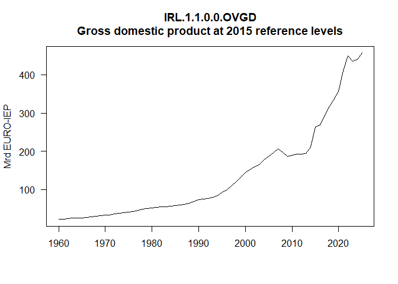
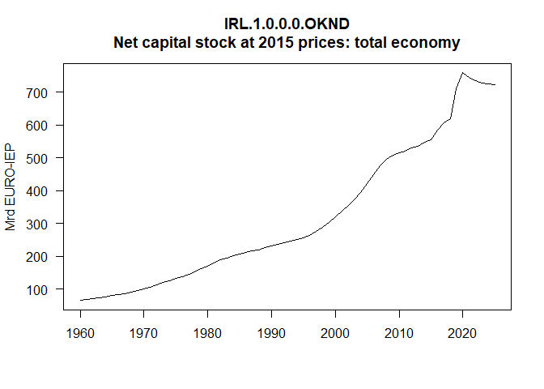
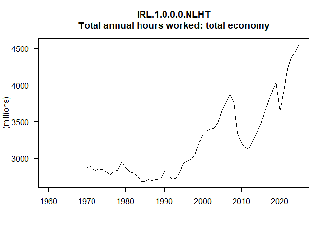
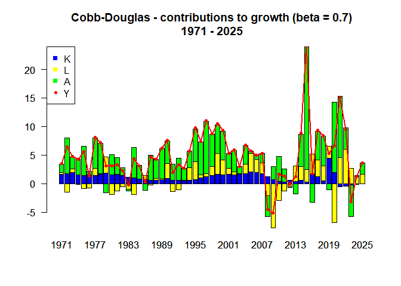
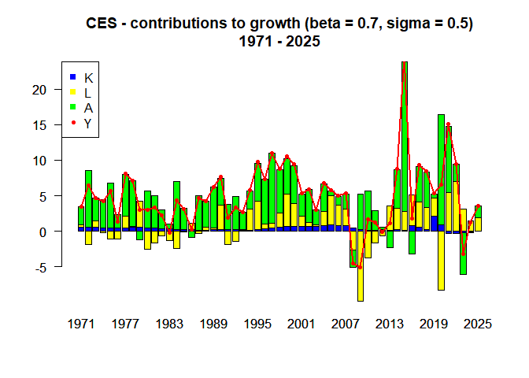

<!-- README.md is generated from README.Rmd. Please edit that file -->

# pfdecomp

<a href="https://xprimexinverse.github.io/pfdecomp/"></a>

UNDER CONSTRUCTION - come back later…

<!-- badges: start -->
<!-- badges: end -->

The goal of pfdecomp is to provide a tool for growth accounting. The
package can be used to decompose a production function into
contributions to growth from capital, labour, and technology. The
production functions that can be used in pfdecomp are (i) Cobb-Douglas
and (ii) CES with labour augmenting technology.

## Installation

You can install the development version of pfdecomp from
[GitHub](https://github.com/) with:

``` r
# install.packages("pak")
pak::pak("xprimexinverse/pfdecomp")
```

## Example

This basic example shows you how to perform growth accounting for
Ireland using data from AMECO:

``` r
library(pfdecomp)
library(ecmacro)

OVGD <- get_series(AMECO_spring_2024, "IRL.1.1.0.0.OVGD")
```



``` r
OKND <- get_series(AMECO_spring_2024, "IRL.1.0.0.0.OKND")
```



``` r
NLHT <- get_series(AMECO_spring_2024, "IRL.1.0.0.0.NLHT")
```



``` r

cd07 <- cobb_douglas(y = window(OVGD, start = 1970), k = window(OKND, start = 1970), l = window(NLHT, start = 1970), beta = 0.7, figure = FALSE)
```



``` r

cd07@contribs
#> Time Series:
#> Start = 1971 
#> End = 2025 
#> Frequency = 1 
#>              y_pc        k_ctg         l_ctg        a_ctg
#> 1971  0.034698101  0.016505743  0.0028849417  0.015278549
#> 1972  0.064899468  0.017039607 -0.0146210032  0.062987124
#> 1973  0.047213815  0.019749563  0.0060990047  0.021154510
#> 1974  0.042600604  0.015456717 -0.0014600505  0.028506803
#> 1975  0.056568614  0.014165493 -0.0085063281  0.051001701
#> 1976  0.013498847  0.014943391 -0.0079625034  0.006856957
#> 1977  0.081209902  0.014567838  0.0126725703  0.052634725
#> 1978  0.071261181  0.016465752  0.0014747210  0.052674105
#> 1979  0.030526978  0.018611707  0.0284388968 -0.015738128
#> 1980  0.030561914  0.015423998 -0.0190119552  0.034934899
#> 1981  0.033056229  0.016688921 -0.0123835899  0.029192804
#> 1982  0.022640274  0.014242744 -0.0052362943  0.013823452
#> 1983 -0.002391222  0.010997777 -0.0095561961 -0.003566672
#> 1984  0.043390399  0.010159028 -0.0188398851  0.052936220
#> 1985  0.030997300  0.008020202 -0.0006752552  0.023560565
#> 1986  0.002896668  0.007161210  0.0073694516 -0.011449474
#> 1987  0.046631540  0.005918159 -0.0027609759  0.043398156
#> 1988  0.042661380  0.005562110  0.0030753743  0.033753806
#> 1989  0.062117677  0.007156456  0.0016390334  0.052907278
#> 1990  0.076380800  0.008621295  0.0266004792  0.039767417
#> 1991  0.019296023  0.006319399 -0.0140509857  0.027421615
#> 1992  0.033433188  0.006092020 -0.0111243463  0.038803063
#> 1993  0.026926048  0.004741098  0.0011391497  0.020943982
#> 1994  0.057558731  0.005596473  0.0227642214  0.028412498
#> 1995  0.098058351  0.007259250  0.0313921355  0.057240359
#> 1996  0.073796762  0.009678305  0.0055835062  0.057718173
#> 1997  0.110217868  0.012161609  0.0050438031  0.091561225
#> 1998  0.087660514  0.014253792  0.0156242281  0.056172083
#> 1999  0.105299499  0.016247305  0.0364518456  0.049967555
#> 2000  0.094035193  0.015786736  0.0257176787  0.050462951
#> 2001  0.053057844  0.015917874  0.0110271524  0.025568427
#> 2002  0.058993537  0.015765737  0.0046665369  0.038006945
#> 2003  0.030140860  0.016302808  0.0015121519  0.012385846
#> 2004  0.067884877  0.017561187  0.0165298555  0.032802337
#> 2005  0.057395642  0.020113094  0.0328761286  0.004222819
#> 2006  0.049878374  0.019591793  0.0226847994  0.007397954
#> 2007  0.053101191  0.017817228  0.0185194395  0.016283588
#> 2008 -0.044840622  0.012749724 -0.0206384093 -0.036723257
#> 2009 -0.050958024  0.007457179 -0.0770349127  0.022187202
#> 2010  0.016829748  0.003544849 -0.0295461294  0.044306920
#> 2011  0.012807448  0.003125139 -0.0124641946  0.022441763
#> 2012 -0.001297067  0.005564876 -0.0051911845 -0.001599991
#> 2013  0.011746495  0.003924236  0.0268869003 -0.018432154
#> 2014  0.088290150  0.006488746  0.0232306716  0.056894306
#> 2015  0.244752100  0.003272006  0.0216539562  0.214528966
#> 2016  0.017655711  0.016607443  0.0357929626 -0.033013075
#> 2017  0.093112599  0.011958715  0.0292959458  0.049803722
#> 2018  0.084702871  0.005313068  0.0257652828  0.052046275
#> 2019  0.052977289  0.045084570  0.0208508800 -0.010867336
#> 2020  0.066172045  0.020068426 -0.0676379028  0.122750775
#> 2021  0.151252255 -0.005419781  0.0459229214  0.107206578
#> 2022  0.094330063 -0.004140347  0.0600871074  0.037345089
#> 2023 -0.031987877 -0.002543059  0.0267918075 -0.054695876
#> 2024  0.012437125 -0.001636699  0.0124557741  0.001656718
#> 2025  0.035927766 -0.000476094  0.0160230717  0.020131409

cd07@avg_gr
#>                             Y          A          K           L
#> Average growth rate 0.0505068 0.03297548 0.01098335 0.006388099

ces05 <- ces(y = window(OVGD, start = 1970), k = window(OKND, start = 1970), l = window(NLHT, start = 1970), beta = 0.7, sigma = 0.5, figure = FALSE)
```



``` r

ces05@contribs
#> Time Series:
#> Start = 1971 
#> End = 2025 
#> Frequency = 1 
#>              y_pc         k_ctg         l_ctg        a_ctg
#> 1971  0.034698101  0.0052468028  0.0037283205  0.025617399
#> 1972  0.064899468  0.0054580260 -0.0188800133  0.079992265
#> 1973  0.047213815  0.0062155586  0.0078902333  0.032822049
#> 1974  0.042600604  0.0048232455 -0.0018905265  0.039750796
#> 1975  0.056568614  0.0044597886 -0.0110041456  0.063889348
#> 1976  0.013498847  0.0045419647 -0.0103377931  0.019516677
#> 1977  0.081209902  0.0045656927  0.0164015153  0.059171473
#> 1978  0.071261181  0.0052406244  0.0019055876  0.063980179
#> 1979  0.030526978  0.0057478650  0.0368629373 -0.011612061
#> 1980  0.030561914  0.0046689360 -0.0246934937  0.051998754
#> 1981  0.033056229  0.0049438078 -0.0161186598  0.045027658
#> 1982  0.022640274  0.0041191336 -0.0068313984  0.025543616
#> 1983 -0.002391222  0.0030608452 -0.0125118666  0.007157511
#> 1984  0.043390399  0.0028534631 -0.0246462337  0.066986040
#> 1985  0.030997300  0.0022620644 -0.0008830277  0.029646862
#> 1986  0.002896668  0.0019784140  0.0096552404 -0.008645964
#> 1987  0.046631540  0.0016781362 -0.0036087251  0.048754428
#> 1988  0.042661380  0.0016145265  0.0040108078  0.036874044
#> 1989  0.062117677  0.0021549533  0.0021299566  0.057697669
#> 1990  0.076380800  0.0027162746  0.0344088706  0.037818525
#> 1991  0.019296023  0.0019875771 -0.0181788443  0.036214212
#> 1992  0.033433188  0.0019407126 -0.0143731337  0.046606273
#> 1993  0.026926048  0.0015268916  0.0014701274  0.023890151
#> 1994  0.057558731  0.0018712039  0.0292583255  0.025596786
#> 1995  0.098058351  0.0026021970  0.0400231830  0.053053729
#> 1996  0.073796762  0.0036089450  0.0070841369  0.062604321
#> 1997  0.110217868  0.0048386255  0.0063454056  0.098325361
#> 1998  0.087660514  0.0058883749  0.0195541051  0.060859627
#> 1999  0.105299499  0.0070375382  0.0453072832  0.050333602
#> 2000  0.094035193  0.0071070678  0.0317775830  0.053196140
#> 2001  0.053057844  0.0071660929  0.0136255043  0.031765837
#> 2002  0.058993537  0.0071410362  0.0057606133  0.045786652
#> 2003  0.030140860  0.0072147979  0.0018734162  0.021007265
#> 2004  0.067884877  0.0078403223  0.0204512750  0.038679890
#> 2005  0.057395642  0.0088984478  0.0407322933  0.007416574
#> 2006  0.049878374  0.0085422876  0.0281679076  0.012754834
#> 2007  0.053101191  0.0077224314  0.0230162904  0.021786089
#> 2008 -0.044840622  0.0050630811 -0.0259709646 -0.024659795
#> 2009 -0.050958024  0.0027422730 -0.0979090856  0.049675580
#> 2010  0.016829748  0.0013100278 -0.0375291796  0.055386704
#> 2011  0.012807448  0.0011576525 -0.0158272175  0.027975138
#> 2012 -0.001297067  0.0020212433 -0.0066079008  0.003314169
#> 2013  0.011746495  0.0014234619  0.0342300656 -0.023022732
#> 2014  0.088290150  0.0025072804  0.0293396301  0.054630244
#> 2015  0.244752100  0.0015567830  0.0265187789  0.210174940
#> 2016  0.017655711  0.0076193463  0.0440950218 -0.032401859
#> 2017  0.093112599  0.0057675118  0.0357960644  0.049478289
#> 2018  0.084702871  0.0027310898  0.0311314636  0.049035443
#> 2019  0.052977289  0.0212145234  0.0255820978  0.006001890
#> 2020  0.066172045  0.0094367918 -0.0829946793  0.154675546
#> 2021  0.151252255 -0.0029880028  0.0547536184  0.093361721
#> 2022  0.094330063 -0.0025329101  0.0700848430  0.024661241
#> 2023 -0.031987877 -0.0015188590  0.0314161882 -0.059603925
#> 2024  0.012437125 -0.0009951164  0.0145483340 -0.001096580
#> 2025  0.035927766 -0.0003003425  0.0185580554  0.017274635

ces05@avg_gr
#>                             Y          A           K          L
#> Average growth rate 0.0505068 0.03872422 0.004115809 0.00764759
```
